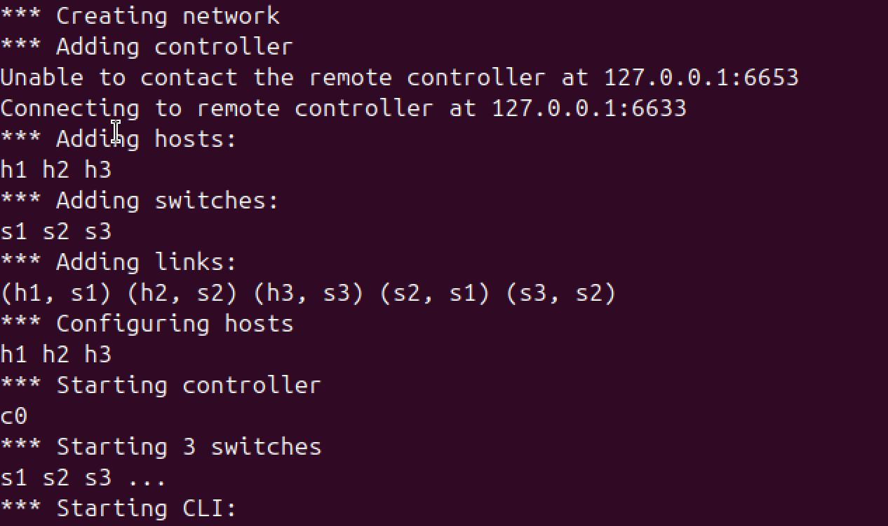
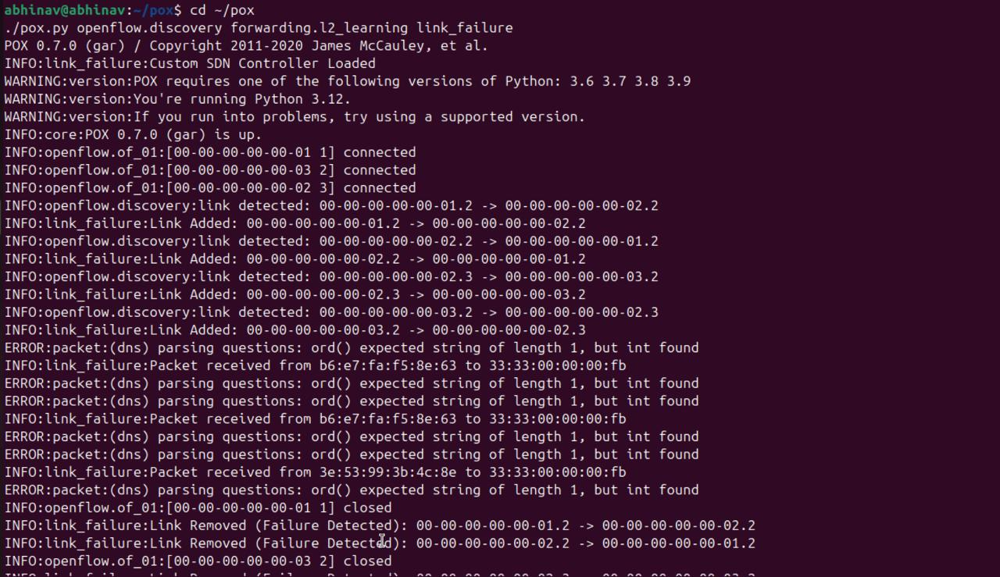
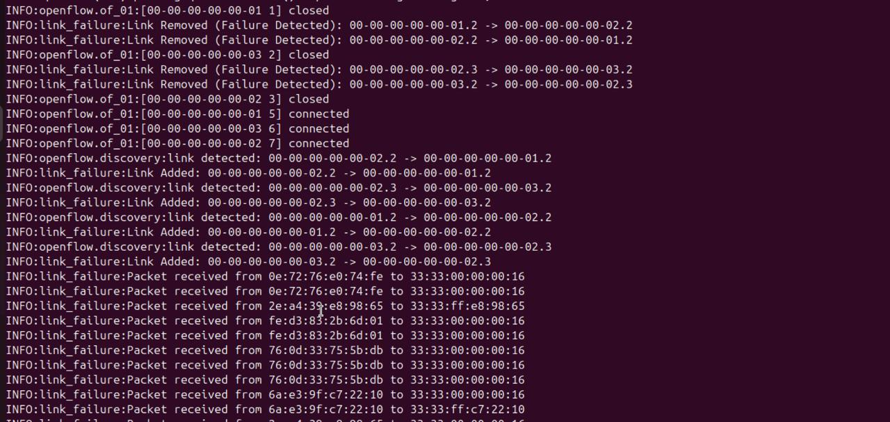
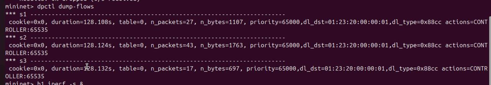
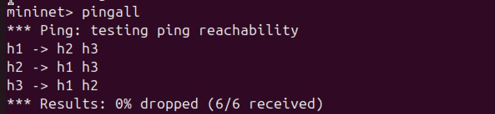
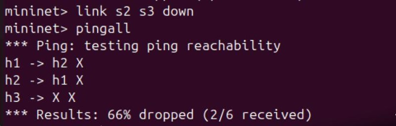
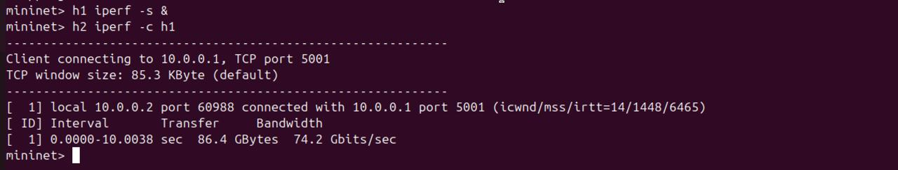

# SDN Link Failure Recovery

## Description
Simulation of link failure recovery using Mininet and SDN controller.

## Features
- Redundant topology
- Link failure simulation
- Recovery testing

## Tools Used
- Mininet
- POX Controller
- Python

## Run Instructions

### Step 1: Start POX Controller
cd pox
./pox.py controller

### Step 2: Run Mininet Topology
sudo mn --custom topology.py --topo mytopo --controller remote

## Results
- Successful communication before failure
- Packet loss during failure
- Recovery after link restoration

  ## Demo Screenshots

### 1. Mininet Topology Design

### 2. Controller Implementation

### 3. Flow Rule Management

### 4. Functionality (Normal Operation)

### 5. Link Failure

### 6. Recovery

### 7. Performance Evaluation (iperf)

